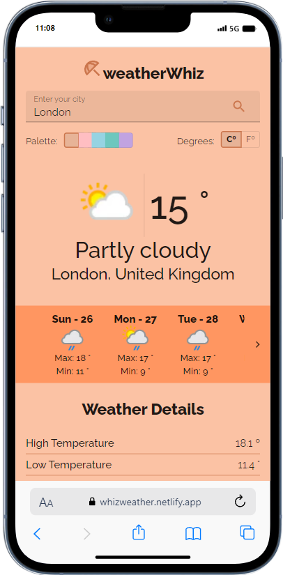

# weatherWhiz

WeatherWhiz is a reliable weather app that offers highly accurate weather forecasts.

Developed with: 
- **React**
- **Material UI**
- https://www.weatherapi.com/

## Features

- Check the weather forecast for up to 14 days.
- Get detailed information such as % humidity, wind direction, % clouds, precipitation... and more.
- Choose whether you want to check the data in Celsius or Fahrenheit.
- Explore different color palettes in the interface.
- Display weather symbols based on conditions (e.g., sunny, cloudy).

## Setup Instructions

### Prerequisites

- Node.js (version 14.x or higher)
- npm (version 6.x or higher) or yarn (version 1.x or higher)

### Installation

1. Clone the repository:

   ```bash
   git clone https://github.com/tarunbisht-24/weather-app.git
   cd weather-app
   ```

2. Install dependencies:

   Using npm:

   ```bash
   npm install
   ```

   Or using yarn:

   ```bash
   yarn install
   ```

### Running the Project Locally

1. Start the development server:

   Using npm:

   ```bash
   npm run dev
   ```

   Or using yarn:

   ```bash
   yarn start
   ```

2. Open your browser and navigate to `http://localhost:3000` to view the application.

### Build for Production

To create a production build:

```bash
npm run build
```

Or using yarn:

```bash
yarn build
```

## Dependencies

- **React** - A JavaScript library for building user interfaces.
- **TypeScript** - A typed superset of JavaScript that compiles to plain JavaScript.
- **Axios** - Used for fetching weather data from the API.
- **react-icons** - For weather symbols.
- **dotenv** - To manage environment variables (like the weather API key).


## [🚀 Live: https://whizweather.netlify.app/ ](https://whizweather.netlify.app/)

[](https://whizweather.netlify.app/)

